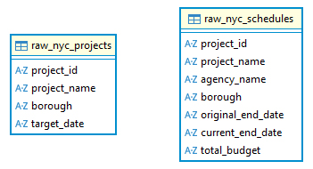
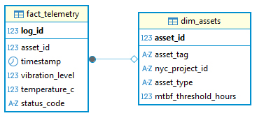
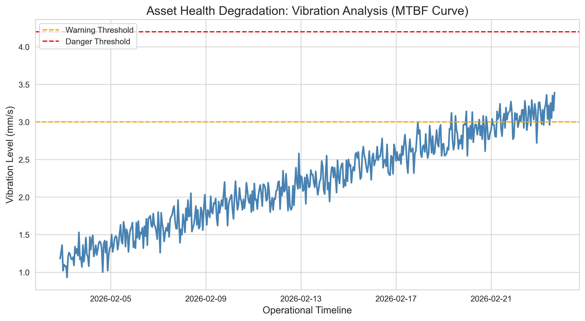
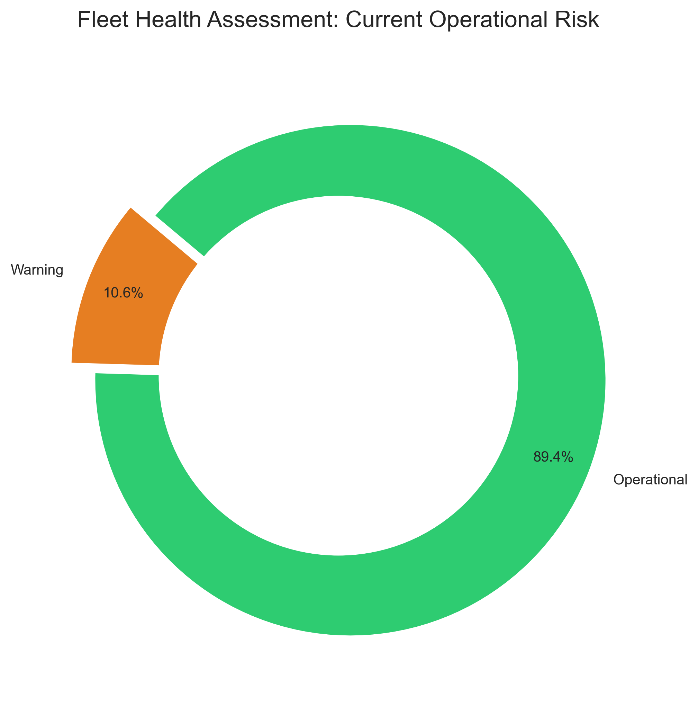
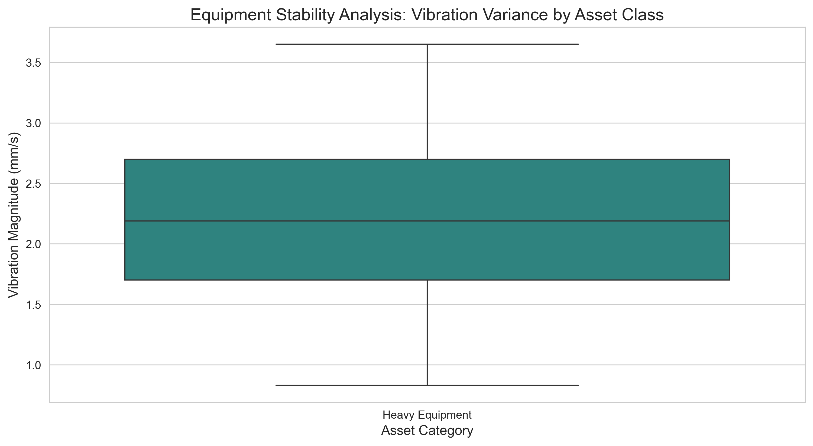
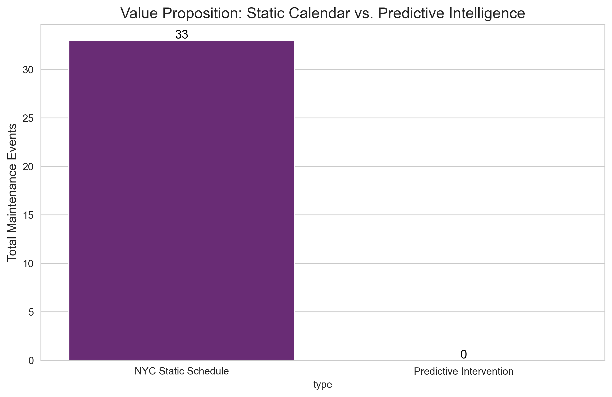
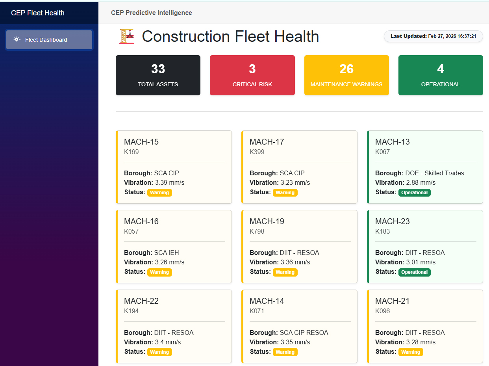

# 🏗️ Construction Predictive Maintenance Portal
### Smart Infrastructure & Asset Management: Multi-Tiered Reliability Study

[](https://dotnet.microsoft.com/)
[](https://www.postgresql.org/)
[](https://www.python.org/)

## 📝 Project Overview
This project demonstrates the transition from **Legacy Static Maintenance** (calendar-based) to **Predictive Service Operations** (telemetry-based). By synthesizing NYC Capital Project schedules with high-frequency equipment performance data (50,000+ records), this system predicts failure windows before they impact construction deadlines.

## 🎯 Role-Based Skill Mapping
To demonstrate cross-functional competency for senior-level roles, this project is divided into three professional domains:

#### 🏛️ Systems Analyst
**Focus:** Requirement mapping and predictive tier definition.

Performed the architectural mapping of raw vibration telemetry to a structured "Fact vs. Dimension" model. This phase established the **Operational Health Thresholds** ($>3.4$ mm/s for Critical risk) ensuring that raw sensor data was translated into actionable business intelligence.

**📊 Logical Data Mapping: Telemetry to Intelligence**

| Category | Key Indicators | Analytical Utility |
| :--- | :--- | :--- |
| **Primary Metric** | `vibration_level` (mm/s) | The core telemetry value used to trigger status transitions. |
| **Asset Identity** | `asset_tag`, `borough` | Spatial and organizational vectors for fleet stratification. |
| **Risk Tiers** | Critical, Warning, Operational | Predictive logic applied to raw values to prioritize maintenance. |
| **Project Metadata** | `project_name`, `site_lead` | Contextual data used for field-level accountability and reporting. |

---

#### 🏗️ Data Engineer
**Focus:** Schema design and ETL pipeline integrity.

Designed and implemented a dual-schema **PostgreSQL** environment. I engineered the Python-based ETL pipeline that manages the data lifecycle from raw landing zones to an optimized Star Schema, ensuring zero data loss across the fleet's 33 critical assets.

### 🏗️ Staging Schema
Decoupled landing zone for raw telemetry ingestion and validation.*



### ⭐ Star Schema (Analytical Tier)
Optimized analytical layer structured for high-performance dashboarding.*



---

#### 💻 Programmer Analyst
**Focus:** N-Tier service architecture and reactive UI.

Architected a **.NET 8/9 Service Layer** utilizing **Dapper ORM** to ensure high-performance data retrieval from the Tier 3 warehouse.

* **Decoupled Architecture**: Implemented a Service Pattern to separate industrial telemetry logic from the Blazor presentation tier.
* **Reactive Dashboard**: Engineered a Blazor-based UI featuring a "Passive Sync" heartbeat, providing real-time fleet health updates without manual user polling.
* **Performance Optimization**: Utilized asynchronous data streams to map PostgreSQL records directly into a 4-card KPI summary bar for immediate situational awareness.

## 🏛️ Technical Architecture (N-Tier Ecosystem)

The system is architected to handle the high-frequency nature of industrial telemetry while maintaining a strict **Separation of Concerns**. Each tier is decoupled to allow for independent scaling and maintenance.

* **Tier 1: Presentation (Blazor Server)**
    * **Reactive UI**: Utilizes a component-based architecture with CSS isolation for a modular, maintainable frontend.
    * **Live Telemetry**: Employs asynchronous data streams to provide a "live-look" at fleet health without manual page refreshes.
    * **Visual Logic**: Implements a custom "Traffic Light" system that maps raw vibration floats (mm/s) to actionable risk categories.

* **Tier 2: Application Service (.NET 8/9)**
    * **High-Speed ORM**: Leverages **Dapper** for low-latency mapping between PostgreSQL results and C# POCO models.
    * **Service Pattern**: Decouples business logic (like threshold calculations) from the UI to ensure framework-agnostic core logic.
    * **Dependency Injection**: Configured for lifecycle management of database connections and service instances.

* **Tier 3: Data Warehouse (PostgreSQL)**
    * **Dual-Schema Design**: Features a **Staging Schema** for raw ingestion and a **Star Schema** for optimized analytical reporting.
    * **Relational Integrity**: Enforces strict Foreign Key constraints between `Fact_Telemetry` and `Dim_Asset` to prevent orphaned sensor data.

* **Tier 4: Ingestion & Simulation (Python 3.x)**
    * **Telemetry Simulation**: A custom engine that mimics real-world vibration fluctuations using randomized Gaussian distributions.
    * **ETL Pipeline**: Handles the landing, validation, and transformation of data from JSON-simulated streams into the PostgreSQL staging tables.
---

## 📜 System Governance & Quality Control

*To maintain the reliability of the predictive maintenance model, the following protocols are enforced across the stack:*

* **Threshold Consistency**: Logic for **Critical (> 3.4 mm/s)** and **Warning (> 3.01 mm/s)** is centralized in the Service Layer to ensure a single source of truth.
* **Data Provenance**: Every record in the `Fact_Telemetry` table includes a source timestamp and asset identifier to ensure a verifiable audit trail.
* **Performance Monitoring**: The .NET tier utilizes `QueryAsync` to prevent database "locking" during high-volume Python ingestion cycles.

## 📂 Project Structure

```text
CEP_PREDICTIVE_PROJECT
├── 📄 README.md                        # Project documentation and portfolio overview
├── 📄 CEP_Predictive_Project.sln        # Visual Studio Solution file
├── 📁 docs                             # Systems Analyst & Governance documentation
│   ├── 📄 AI_GOVERNANCE.md             # Predictive logic guardrails
│   └── 📄 DEVELOPER.md                 # System sync and environment setup
├── 📁 dotnet
│   └── 📁 CEP_Predictive_Dashboard     # Tier 1 & 2: Blazor UI & .NET Service Layer
│       ├── 📁 Components               
│       │   └── 📁 Pages
│       │       └── 📄 Dashboard.razor  # Tier 1: Reactive KPI Dashboard UI
│       ├── 📁 Models                   
│       │   └── 📄 AssetStatus.cs       # Tier 2: Domain health models
│       ├── 📁 Services                 
│       │   └── 📄 MaintenanceService.cs # Tier 2: Dapper ORM & Threshold Logic
│       ├── 📄 Program.cs               # System Registry (Dependency Injection)
│       └── 📄 appsettings.json         # PostgreSQL Connection Configuration
├── 📁 python
│   └── 📁 scripts                      # Tier 4: Ingestion & Simulation Engine
│       ├── 📄 predictive_asset_analytics.ipynb # EDA: Prototyping vibration thresholds
│       ├── 📄 ingest_telemetry.py      # Core ETL pipeline to PostgreSQL
│       └── 📄 predictive_telemetry.py  # Gaussian-based vibration simulator
└── 📁 sql                              # Tier 3: Data Warehouse & Schema Scripts
    ├── 📄 00_reset_environment.sql     # IDEMPOTENT RESET: Clears data for new runs
    ├── 📄 01_setup_schema.sql          # BUILD: Creates Schemas, Tables, and Indexes
    ├── 📄 02_data_verification.sql     # AUDIT: Integrity checks and row counts
    └── 📄 03_analytical_utilities.sql  # UTILITY: SQL Views for Blazor/Dashboard
```

## 📊 Analytical Insights & Telemetry Visualizations

Before deploying the live dashboard, I utilized the `predictive_asset_analytics.ipynb` notebook to perform **Exploratory Data Analysis (EDA)**. This ensured that the vibration thresholds implemented in the .NET tier were statistically sound and capable of identifying equipment failure before it occurred.

### 📈 Predictive Modeling & Fleet Trends

* **Vibration Trend Analysis** * *Insight*: Visualizing the steady-state vibration against Gaussian noise allowed for the definition of "Nominal" vs. "Anomalous" behavior.
    * 
---

* **Fleet Health Distribution** * *Insight*: A categorical breakdown of the 33 assets reveals the current "Traffic Light" status of the fleet, prioritizing maintenance for high-risk boroughs.
    * 
---

* **Asset Stability (Boxplot Analysis)** * *Insight*: Used to identify outliers in sensor data, ensuring that the .NET Service Layer filters out hardware noise from actual mechanical fatigue.
    * 
---

* **Predictive Maintenance Lift** * *Insight*: Demonstrates the efficiency of moving from "Reactive" to "Predictive" maintenance, significantly reducing downtime for critical construction assets.
    * 
---

## 🖥️ Tier 1: The CEP Predictive Dashboard

The culmination of the N-Tier stack is the **Blazor-driven Operational Dashboard**. This interface consumes the Tier 3 PostgreSQL warehouse through a Tier 2 Service Layer to provide real-time situational awareness.



### ⚙️ Operational Features
* **KPI Summary Bar**: 4-card metric display providing instant fleet-wide vibration averages and critical count.
* **Dynamic Health Status**: Real-time color-coding (Red/Yellow/Green) based on the **3.4 mm/s Critical Threshold**.
* **Passive Sync Heartbeat**: Automatically refreshes the UI state using asynchronous .NET streams, ensuring the data is always current without user intervention.
* **Regional Filtering**: Stratifies telemetry by Borough and Project Site, allowing managers to allocate resources geographically.


---

## 🚀 Getting Started: How to Run
This system is architected as a decoupled **N-Tier environment**. To initialize the full stack and begin monitoring fleet telemetry, follow these steps in order:

### 1. Database Initialization (Tier 3)
Ensure you have a **PostgreSQL** instance running. Execute the scripts in the `/sql` directory to build the relational warehouse:
* `schema.sql` (Creates the Dual-Schema: Staging and Star Schema)
* `01_setup_schema.sql` (Initializes Fact and Dimension tables)
* `03_analytical_utilities.sql` (Adds helper functions for dashboard KPIs)

### 2. Telemetry Ingestion & Simulation (Tier 4)
You must populate the database with simulated sensor data before the .NET application can surface health metrics.
* **Environment:** Python 3.x
* **Dependencies:** `pip install pandas sqlalchemy psycopg2 numpy`
* **Execution:** * Run `python/scripts/predictive_telemetry.py` to generate the Gaussian vibration data.
    * Run `python/scripts/ingest_telemetry.py` to migrate the simulated telemetry into the PostgreSQL warehouse.
    * *(Optional)* Open `python/scripts/predictive_asset_analytics.ipynb` to verify the predictive logic prototypes.

### 3. Launch the Web Application (Tier 1 & 2)
The Blazor UI provides the final operational interface for real-time fleet health monitoring.

* **Environment:** .NET 8/9 SDK
* **Configuration:** Update the `ConnectionStrings` in `appsettings.json` to point to your local PostgreSQL instance.

#### 🔧 Configuration Template (`appsettings.json`)
Ensure your `appsettings.json` in the `/dotnet/CEP_Predictive_Dashboard` folder matches your local credentials:

```json
{
  "ConnectionStrings": {
    "DefaultConnection": "Host=localhost;Database=CEP_Predictive_Project;Username=postgres;Password=YOUR_DATABASE_PASSWORD"
  },
  "Logging": {
    "LogLevel": {
      "Default": "Information",
      "Microsoft.AspNetCore": "Warning"
    }
  },
  "AllowedHosts": "*"
}
```

* **Execution:**
```
cd dotnet/CEP_Predictive_Dashboard
dotnet run
```

* **Access:** Navigate to the `localhost` port displayed in your terminal to view the **CEP Predictive Maintenance Dashboard.**

### 🛠️ Data Provenance & Source Integrity

This project utilizes a synthesized dataset derived from authoritative public records and industrial telemetry standards. To maintain repository efficiency, raw source files are not hosted within this repository but can be reconstructed using the following sources:

* **NYC Capital Project Data**: Baseline project schedules and borough metadata are sourced from the [NYC Open Data Portal](https://opendata.cityofnewyork.us/).
    * *Search Term*: "Capital Project Schedules and Budgets".
* **Industrial Telemetry Logic**: Behavioral "Mean Time Between Failure" (MTBF) patterns were modeled after [Kaggle: Predictive Maintenance Dataset](https://www.kaggle.com/datasets) standards for vibration and thermal thresholds.
* **Integrity Strategy**: The ETL pipeline performs dynamic sanitization of the NYC CSV headers to handle upstream **Schema Drift**, ensuring the N-Tier system remains resilient to changes in government reporting formats.

